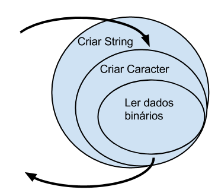

# Design Patterns

Um padrão de projeto é uma solução elegante para um problema que é recorrente no dia-a-dia do desenvolvedor.

Por mais que desenvolvamos projetos diferentes, muitos dos problemas se repetem. Padrões de projeto são soluções
elegantes e flexíveis para esses problemas.

### Motivação dos padrões
O mais importante ao estudar padrões de projeto é entender qual a real motivação do padrão, e quando ele deve ser
aplicado. As implementações são menos importantes, pois eles podem variar. O importante é resolver o problema de maneira
elegante, usando a ideia por trás do padrão como um guia na implementação.E eles também servem para comunicar soluções
entre desenvolvedores.

## Padrão Strategy
O padrão Strategy é muito útil quando temos um conjunto de algoritmos similares, e precisamos alternar entre eles em 
diferentes pedaços da aplicação. No exemplo do vídeo, temos diferentes maneira de calcular o imposto, e precisamos 
alternar entre elas.

O Strategy nos oferece uma maneira flexível para escrever diversos algoritmos diferentes, e de passar esses algoritmos 
para classes clientes que precisam deles. Esses clientes desconhecem qual é o algoritmo "real" que está sendo executado, 
e apenas manda o algoritmo rodar. Isso faz com que o código da classe cliente fique bastante desacoplado das 
implementações dos algoritmos, possibilitando assim com que esse cliente consiga trabalhar com N diferentes algoritmos 
sem precisar alterar o seu código.

### Strategy o tempo todo?
- Se eu tenho apenas uma única estratégia, faz sentido implementar o Strategy?
Depende do problema. Lembre-se que códigos simples são mais fáceis de manter sempre. Se você só tem uma estratégia, 
- talvez faça mais sentido você não usar o Strategy, já que você estaria flexibilizando algo sem necessidade.

Mas, se é nítido que novas estratégias aparecerão, com certeza um Strategy é mais limpo do que um conjunto de ifs, 
conforme discutimos nesse capítulo.

Novamente, avalie o contexto e veja se o padrão de projeto vai trazer benefícios para aquele cenário.

## Chain of Responsibility
A ideia do padrão é resolver problemas como: de acordo com o cenário, devemos realizar alguma ação. Ao invés de 
escrevermos código procedural, e deixarmos um único método descobrir o que deve ser feito, quebramos essas 
responsabilidades em várias diferentes classes, e as unimos como uma corrente.

### Quando usar o Chain of Responsibility?
O padrão Chain of Responsibility cai como uma luva quando temos uma lista de comandos a serem executados de acordo com 
algum cenário em específico, e sabemos também qual o próximo cenário que deve ser validado, caso o anterior não 
satisfaça a condição.

Nesses casos, o Chain of Responsibility nos possibilita a separação de responsabilidades em classes pequenas e enxutas, 
e ainda provê uma maneira flexível e desacoplada de juntar esses comportamentos novamente.

## Desvantagens de Patterns
Com certeza, com os padrões de projeto Strategy ou Chain of Responsibility o nosso código fica mais limpo do que usar um
conjunto de ifs, conforme discutimos nesses capítulos. Ganhamos flexibilidade em introduzir ou tirar novas 
responsabilidade sem mexer no código existente. Mas qualquer mudança não só traz beneficios. 
Os padrões de projetos tentam separar as responsabilidades para deixar o código mais flexível, mas introduzem uma 
indireção, eles delegam o trabalho para outras classes que pode deixar o código mais complexo e difícil de entender. 
Na hora de aplicar o padrão sempre coloque esse questão na ponta de língua e tente avaliar se realmente vale a pena.

## Template Method
Quando temos diferentes algoritmos que possuem estruturas parecidas, o Template Method é uma boa solução. Com ele 
conseguimos definir em um nível mais macro a estrutura do algoritmo, deixando "buracos" que serão implementados de 
maneira diferente por cada uma das implementações específicas.

Dessa forma, reutilizamos o nosso código ao invés de repeti-lo, facilitando possíveis evoluções, tanto do algoritmo em 
sua estrutura macro, quanto dos detalhes do algoritmo, já que cada classe tem sua responsabilidade bem separada.

### O princípio de Hollywood
Repare que no padrão Template method a classe mãe controla os filhos. Os filhos preenchem apenas as lacunas da mãe, 
aquele métodos abstratos, mas a classe mãe está no poder e chama estes métodos dos filhos.

Esse fato que filhos não ficam mais no controle da execução também é chamado de The Hollywood Principle. Esse princípio 
diz: “Don't call us, we'll call you”! Ou seja, invés você (os filhos) ficarem chamando a classe pai, o controle é 
invertido e a classe mãe chama os filhos.

A ideia de inverter o controle (IoC - Inversion of Control) vai muito mais longe e não é usado apenas no Template Method.
A inversão de controle é um princípio fundamental no desenvolvimento e é utilizado em qualquer framework ou container. 
No Django, por exemplo, você consegue com poucas classes e funções criar aplicações complexas pois tem inversão de 
controle! O Django chama as suas funções, ou seja, ele esta no poder e segue o Principio de Hollywood.

Se não tivesse a ajuda do Django e a inversão de controle, o desenvolvedor seria responsável em fazer o parsing dos 
cabeçalhos HTTP, mapear uma URL para uma função, abrir e fechar a conexão e transação, fazer o tratamento de erro, 
renderizar a resposta etc etc etc .... Tudo isso o Django prepara antes de chamar o código da aplicação. Falando um 
pouco simplificado, o Django é o template, a grande mãe que prepara tudo para o nosso código ficar o mais simples 
possível.

## Decorator
### Quando devemos aplicar o padrão Decorator? 
O Decorator introduz a flexibilidade na composição desses comportamentos, bastando escolher no momento da instanciação, 
quais instancias serão utilizadas para realizar o trabalho.

### Decorator ou Chain of Responsibility
O Decorator é para compor e dividir comportamento em fatias onde cada fatia (objeto) representa uma parte da 
responsabilidade. Os Decorators modificam/melhoram o comportamento original. A intenção do Chain of Responsabilidade não
é dividir a responsabilidade em fatias menores e sim criar uma cadeia de decisão onde cada objeto representa uma 
responsabilidade.

Um exemplo clássico de um Decorator é a leitura de um arquivo. Imagine uma classe que saiba abrir um arquivo para ler 
dados binários. Nem sempre queremos ler bits e bytes quando se trata de texto. Sendo assim, podemos criar uma classe que
decora o comportamento para transformar 2 byte em um caracter, por exemplo. Ler um arquivo caracter por caracter,também 
não é tão funcional, melhor seria linha por linha. Podemos criar mais um decorator que transforma os caracteres em 
strings. Os decorators nesse exemplo melhoram o comportamento original (leitura) e dividem a responsabilidade.

## State
A principal situação que faz emergir o Design Pattern State é a necessidade de implementação de uma máquina de estados. 
Geralmente, o controle das possíveis transições entre estados são várias, também são complexas, fazendo com que a 
implementação não seja simples. O State auxilia a manter o controle dos estados simples e organizados, através da 
criação de classes que representem cada estado e sabendo controlar as transições entre eles.

## Builder

Sempre que tivermos um objeto complexo de ser criado, que possui diversos atributos, ou que possui uma lógica de criação
complicada, podemos esconder tudo isso em um Builder.

Porém, na linguagem Python, esse pattern muitas vezes é desnecessário, já que parâmetros nomeados e opcionais do 
construtor de classes podem muitas vezes lidar com a complexidade de criação do objeto.